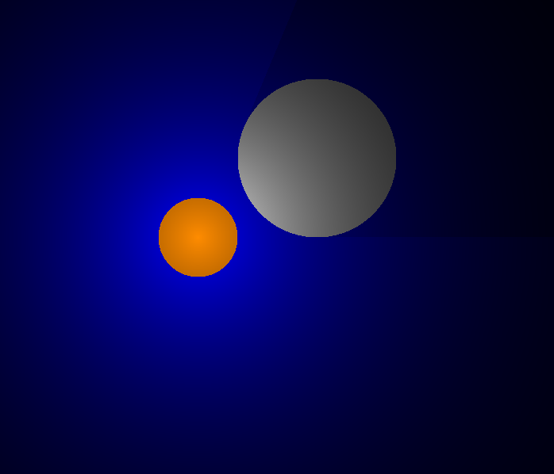

# Raytracing-Simples


Este é um projeto simples de **Raytracing em 2D**, desenvolvido em **C** utilizando a biblioteca **SDL3** para renderização gráfica e **math.h** para cálculos matemáticos.

## 📌 Objetivo

Simular o comportamento da luz ao interagir com objetos circulares em um plano 2D, com suporte para opacidade, brilho e interação com o mouse.

---

## 🧠 Funcionalidades

- Representação de círculos brilhantes e opacos
- Cálculo de iluminação com base na distância
- Simulação de raio de luz (light falloff)
- Interação com o mouse: clique e arraste objetos
- Visualização em tempo real com SDL

---

## 🛠️ Tecnologias usadas

- **Linguagem:** C
- **Gráficos:** [SDL3](https://github.com/libsdl-org/SDL)
- **Cálculos:** `math.h` (raiz quadrada, potência, etc.)

---

## 🧪 Como compilar

### Pré-requisitos:

- GCC ou outro compilador C
- SDL3 (baixe a versão `SDL3-devel` para MinGW se estiver no Windows)

### Exemplo de compilação no terminal (Windows + MinGW):

```bash
gcc main.c -IC:/caminho/para/SDL3/include -LC:/caminho/para/SDL3/lib -lSDL3 -lm -o rayt

